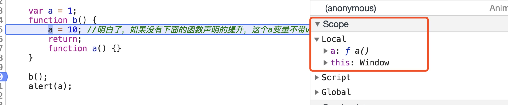
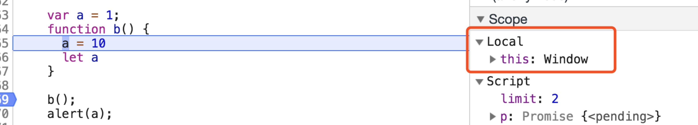

先看两道题

```
var foo = 1;
function bar() {
    if (!foo) {
        var foo = 10;
    }
    alert(foo);
}
bar();
```

```
var a = 1;
function b() {
    a = 10;
    return;
    function a() {}
}
b();
alert(a);
```

上面的答案分别是10和1，如果你答对了，可以略过下面的内容了，如果答错了，就继续看下去吧。

在分析题目之前，我们先说一下JS中的变量提升。

JS代码在执行之前会先进行编译工作，编译就是找到当前环境中所有的声明，包括函数的声明和变量的声明，看下图就知道，在正式执行函数b的代码之前，作用域中已经存在了变量了，说明内存中已经有了：



JS中变量声明会提升，但是初始化赋值不会提升，这里需要注意var声明的变量会提升，let声明的是不会提升的：



而且JS中用function来声明的函数是同时完成了声明和赋值操作，所以提升后的函数自带初始化，但是用变量声明的函数是两步操作：函数声明+初始化赋值，因此函数提升的时候是只提升了声明，不会提升初始化：

```
function a () {
      console.log('我的声明和初始化一气呵成');
    }

    var a = function () {
      console.log('我声明结束后，还需要一步赋值操作');
    }
```

说了这么多，其实JS中变量的提升本质就是在执行之前的编译阶段，会找到声明的变量，把这些声明放到当前作用域的头部。

回过头来看看这两道题，先说第一道：

执行到bar函数内部的时候，`var foo = 10`这条语句的声明会提升，因此foo就是undefined，那么`!foo`就为真了，进入if语句内部，执行了`foo = 10`，因此alert的结果是10。

再看第二道：

执行到b函数内部时，在return语句下面的函数声明会提升到b函数作用域的顶部，因此执行到`a = 10`语句的时候，是对b函数内部局部作用域中的变量a的重新赋值，不会影响到全局作用域中的a变量，因此在全局作用域中执行`alert(a)`就还是10。

试想一下，如果去掉b函数内部的函数声明，打印出的会是什么呢？

当然是10啦，因为没有了函数声明语句，在b函数内部只有一句a = 10，前面没有var关键字，那么这条语句相当于是声明一个全局变量，因此会影响到外面的alert语句。

