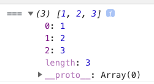
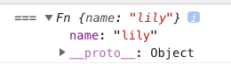
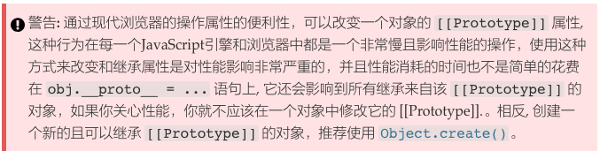

JS中new关键字的探索与联想

非常好的参考资料
https://github.com/mqyqingfeng/Blog/issues/13
https://juejin.im/post/59c9bc855188254f58413aa0

原理主要是：用new关键字创造的实例，有构造函数中的属性和方法，也有构造函数原型上的属性和方法，所以我们写一个函数来实现这个功能，设想如果用new关键去创建对象的时候是怎么写的？

```
var obj = new Ctor()
```

那么我们用一个函数来代替new关键字，使用的时候可以这样写：

```
var obj = mockNew(Ctor)
```

下面就看一下如何实现这个mockNew

```
function mockNew() {
      var Constructor = [].shift.call(arguments)
      var obj = Object.create(Constructor.prototype)
      var ret = Constructor.apply(obj, arguments)
      return obj
    }
```

函数实现后，我们看下如何调用：

```
    function mockNew() {
      var Constructor = [].shift.call(arguments)
      var obj = Object.create(Constructor.prototype) //这条语句可以实现构造函数原型上的属性和方法继承给了实例对象
      var ret = Constructor.apply(obj, arguments) //这条语句可以实现把构造函数上的私有属性和方法变成实例对象的私有属性和方法
      return obj
    }

    function Fn(name) {
      this.name = name
    }
    Fn.prototype.sayHello = function () {
      console.log('Hello, ', this.name);
    }
    
    var obj = mockNew(Fn, 'lily')

    console.log('===', obj);
```

上面这样写，还不够完美，如果构造函数有返回值会怎么样？如果返回值是引用类型，会怎么样？是基本数据类型，又会怎么样？我们可以做个试验，看看构造函数返回引用类型会怎么样：

```
function Fn(name) {
      this.name = name
      return [1, 2, 3]
    }
    var obj = new Fn('lily')
```

发现用new关键字调用的结果返回的是这个引用类型值：



如果返回的是基本数据类型呢？

```
function Fn(name) {
      this.name = name
      return 1
    }
    var obj = new Fn('lily')
```

可以看到结果如下：



因此我们需要修改上面的`mockNew`函数：

```
function mockNew() {
      var Constructor = [].shift.call(arguments)
      var obj = Object.create(Constructor.prototype)
      var ret = Constructor.apply(obj, arguments)
      return (typeof ret === 'object' || typeof ret === 'function') ? ret : obj
    }
```

不过这样还不够完美，因为有个特殊基本类型null，如果执行`typeof null`会发现也是'object'，因此还需要考虑这种情况：

```
function mockNew() {
      var Constructor = [].shift.call(arguments)
      var obj = Object.create(Constructor.prototype)
      var ret = Constructor.apply(obj, arguments)
      return (typeof ret === 'object' || typeof ret === 'function') ? ret || obj : obj
    }
```

到这里，我们的函数基本就完美了，我们进一步思考，让实例对象继承构造函数原型对象上的属性和方法，还有其他方式吗？有，也可以用这样的语句：

```
//第一种方式
var obj = Object.create(Constructor.prototype)
//第二种方式
obj.__proto__ = Constructor.prototype
```

网上有很多种实现方式是采用的第二种方法，但是哪一种性能比较好呢？作为一个优秀的工程师，应该不仅仅满足于实现，而是不断思考如何更好的实现，我们查看一下MDN文档，发现有这样一段说明：



因此比较过后，还是第一种实现方式更优。

还有一些补充：
进一步深入思考，如果不用new关键字调用构造函数呢？比如有一个构造函数Foo，直接写成Foo()，这种情况就是普通的函数调用，此时构造函数内部的this指向的就是全局对象，所以这种调用方式和加入new关键字的调用方式是不同的。

## 不使用new呢？

如果不使用new关键字，那就是函数调用，本质上就是执行内存中window对象上的代码。

而函数定义这个操作，本身就是给window这个JSON对象添加成员。

比如：

```
//以下函数定义的实现是window.Foo = function(){}
var Foo = function() {
  this.a = 1
  this.b = 2
}
Foo() //将会给window对象添加两个属性A和B，因为此时this指向的是window对象
```

进一步思考：

```
function Animal (name) {
  this.name = name
}
Animal.color = 'black'
Animal.prototype.say = function() {
  console.log(this.name)
}
var cat = new Animal('cat')
console.log(
	cat.name, //cat
	cat.height //undefined
)
cat.say() //cat

console.log(
	Animal.name, //Animal
	Animal.color //black
)
Animal.say() //Animal.say is not a function
```

原来每一个函数都有很多属性，其中的name就是指的函数名本身
还遇到一个caller属性指的什么呢？

进一步拓展：
了解了this是什么对象后，就知道了下面两个图中打印的this结果了

```
function Person() {
  this.age = 0
  function growUp() {
    console.log('====', this) //window全局对象
  }
  growUp()
}

var p = new Person()
```

```
function Person() {
  this.age = 0
  function growUp() {
    console.log('=====', this) //p实例对象
  }
  growUp.call(this)
}
var p = new Person()
```

再进一步拓展，加上箭头函数：

```
function Person() {
  this.age = 0
  var growUp = () => {
    console.log('====', this) //p实例对象，因为箭头函数没有自己的this，只会继承所在作用域链上层的this
  }
  growUp()
}
var p = new Person()
```

```
function Person() {
  this.age = 0
  var growUp = () => {
    console.log('====', this) //全局对象window
  }
  growUp()
}
Person()
```


可以看到只要了解了JS中的一些基本概念和原理，万变不离其宗。

