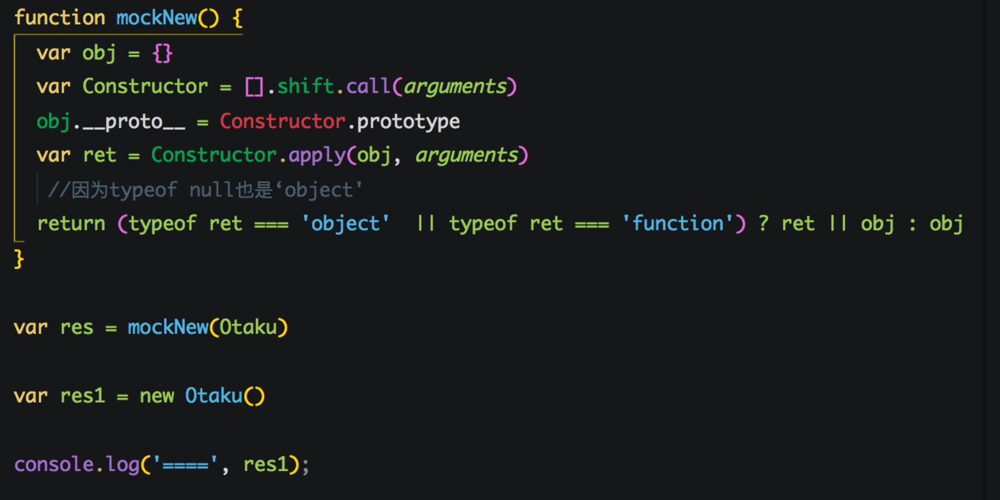
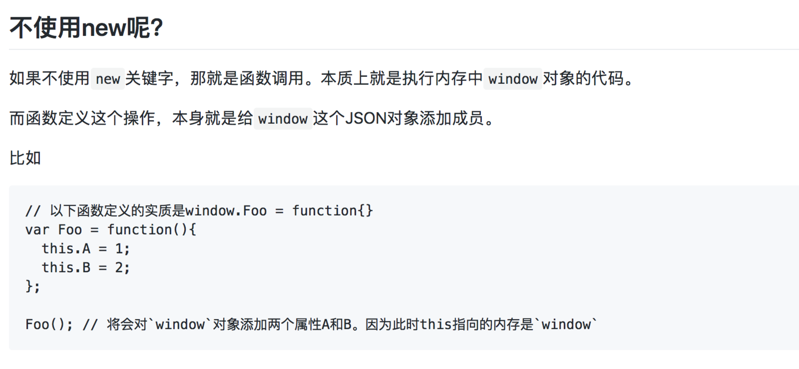
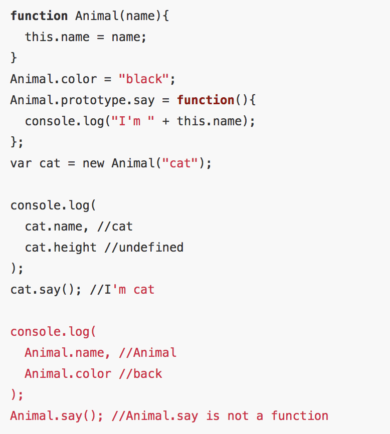
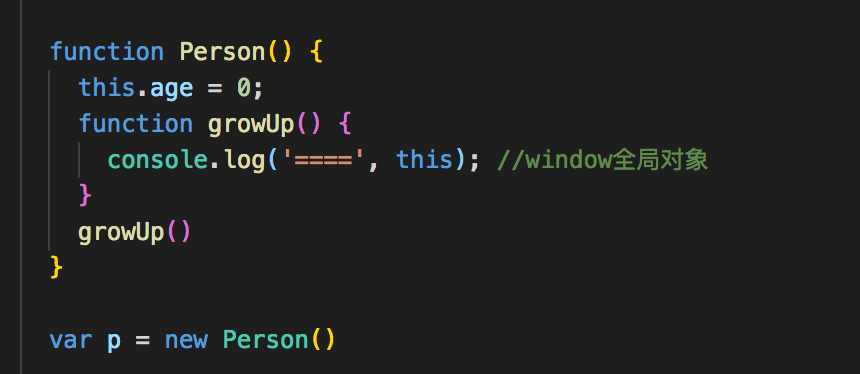
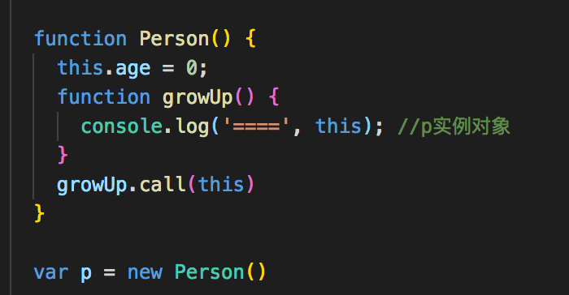
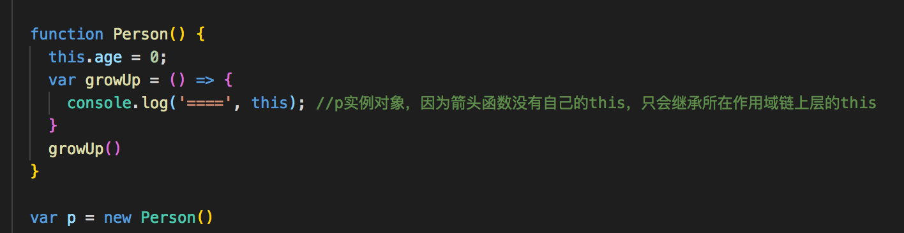
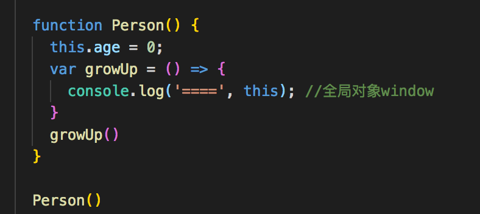

JS中new关键字的探索与联想

非常好的参考资料
https://github.com/mqyqingfeng/Blog/issues/13
https://juejin.im/post/59c9bc855188254f58413aa0

原理主要是：用new关键字创造的实例，有构造函数中的属性和方法，也有构造函数原型上的属性和方法，所以我们写一个函数来实现这个功能

还有一些补充：
进一步深入思考，如果不用new关键字调用构造函数呢？比如有一个构造函数Foo，直接写成Foo()，这种情况就是普通的函数调用，此时构造函数内部的this指向的就是全局对象，所以这种调用方式和加入new关键字的调用方式是不同的。

进一步思考：

原来每一个函数都有很多属性，其中的name就是指的函数名本身
还遇到一个caller属性指的什么呢？

进一步拓展：
了解了this是什么对象后，就知道了下面两个图中打印的this结果了

再进一步拓展，加上箭头函数：

可以看到万变不离其宗

