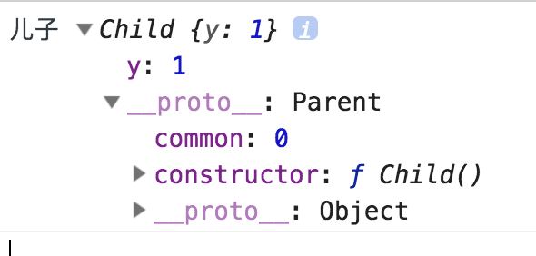
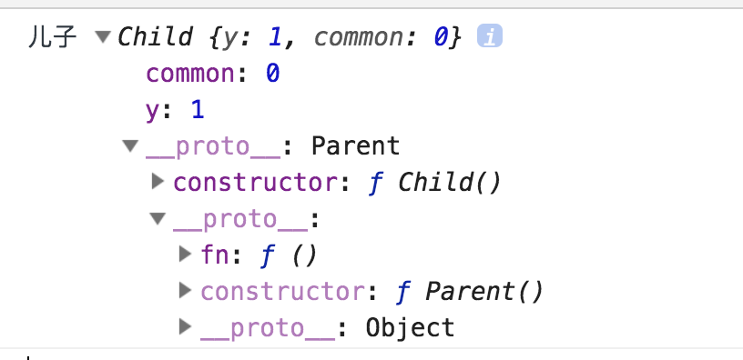

参考资料： 

<https://juejin.im/entry/58be60de570c350059b65399>

实在是有太多种方式实现继承了，那么一般框架的源码都是采用哪种继承方式呢？为什么采用这种继承方式呢？ 

给我印象最深的就是两种继承方式： 

一、纯粹的原型继承 

```
function Parent () {

  this.common = 0

}

function Child() {

  this.y = 1

}

Parent.prototype.fn = function(){}

Child.prototype = new Parent()

Child.prototype.constructor = Child

var son = new Child()

console.log('儿子', son);
```



这种继承方式会把父类的私有属性和方法变成子类的公有属性和方法，如果子类创建了不同的实例，有一个实例操作了这些公有属性，其他的实例中的公有属性就会被修改，所以虽然这种方式是实现继承最容易想到的方式，但一般项目实践中不会用这种方式去实现继承。

二、call和Object.create结合的

```
function Parent () {

  this.common = 0

}

function Child() {

  this.y = 1

  Parent.call(this)

}

Parent.prototype.fn = function(){}

Child.prototype = Object.create(Parent.prototype)

Child.prototype.constructor = Child

var son = new Child()

console.log('儿子', son);
```



这种方式的继承首先通过call方法将父类的私有属性和方法变成了子类的私有属性和方法（这一步骤如果不是很明白的话，建议参考JS new关键字那篇文章，了解下new 和 call的原理），然后再通过Object.create创建了一个对象，这个对象的`__proto__`属性指向的是父类的prototype，然后把这个对象赋值给了子类的prototype对象，实现了原型链的继承。

一般项目实践中对会采用第二种继承方式。