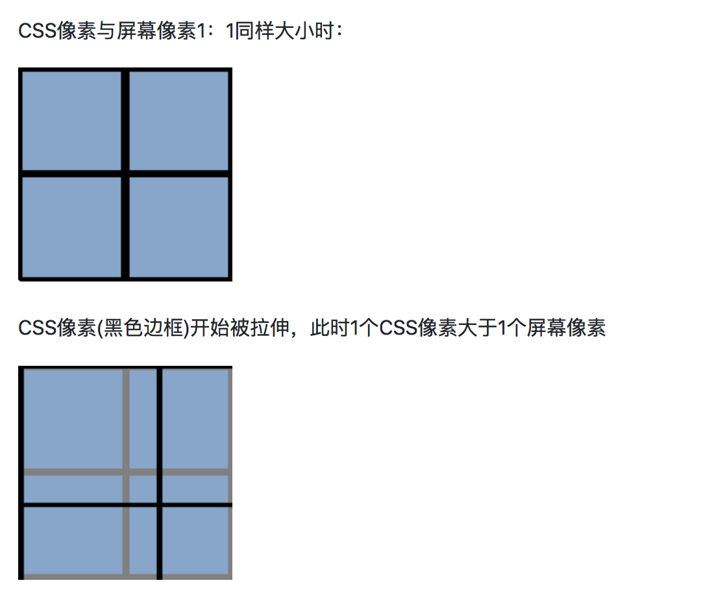

前言：

flexible链接：https://github.com/amfe/lib-flexible

一、手淘flexible的适配原理

它可以动态修改html标签上的font-size值和meta标签，部分源码如下：

```
     docEl.setAttribute('data-dpr', dpr);
    if (!metaEl) {
        metaEl = doc.createElement('meta');
        metaEl.setAttribute('name', 'viewport');
        metaEl.setAttribute('content', 'initial-scale=' + scale + ', maximum-scale=' + scale + ', minimum-scale=' + scale + ', user-scalable=no');

        if (docEl.firstElementChild) {
            docEl.firstElementChild.appendChild(metaEl);
        } else {
            var wrap = doc.createElement('div');
            wrap.appendChild(metaEl);
            doc.write(wrap.innerHTML);
        }
    }
```

想看懂上面的代码，还需要了解几个基础知识：

1、什么是dpr？

dpr就是设备像素比，dpr=物理像素/CSS像素，我们开发的时候写的是CSS像素，最后是用物理像素来表达。

2、什么是CSS像素？

在早期PC时代，还没有高清屏，一格物理像素=一格CSS像素，dpr是1。后来iphone出了retina屏，dpr是2了，也就是说现在一格CSS像素需要2*2格物理像素来表达了。



那也就是说原来的那些老网站在手机端看是看不全的，那么如何让用户能在小屏上看全网站的所有内容呢？用现实去类比，如果你站在一幅很大的画前面，无法看清这幅画的全部，你怎么做才能看清这幅画的真面目呢？当然是退后，站在远一点的位置，这幅画才能尽收眼底。在开发世界中也是一样的，我们通过设置meta标签中的视口宽度来达到这个效果。现在在dpr是2的手机上，视口宽度是原来的2倍了，那只有设置initial-scale=0.5，把视口宽度缩小，我们才能看到整个网站，只不过缩小后的窗口字体有点小，那为了解决这个问题，我们就引入了rem。

rem是相对于html的font-size大小的，比如在iphone6上，我们给html加上font-size:75px，那此时1rem=75px；如果750的设计稿上，有个图片宽度是200，那么在CSS中我们就这么写width:200/75rem; 在iphoneX上，flexible会帮我们修改html上的font-size大小为112.5px，那么那张图片此时的宽度就是200/75*112.5px宽了，所以这张图不管在什么机型上，看起来都是差不多大的。

二、vue中如何引入flexible呢？

首先`npm i -S lib-flexible`安装这个包，然后在main.js中引入 import from 'lib-flexible'

在开发的时候还是用px去开发，需要下载一个px2rem的loader，配置在webpack中，这样webpack会自动帮你把px编译成rem的单位。

webpack配置如下：

```
{
        test: /\.less$/,
        use:ExtractTextPlugin.extract({
          fallback:"style-loader",
          use:[{
            loader:"css-loader",
            options:{
              minimize: true //css压缩
            }
          },
          {
            loader:"px2rem-loader",
          },
          {
            loader: 'postcss-loader',
            options: {
              sourceMap: true
            }
          },
          {
            loader:"less-loader"
          }]
        })
  }
```

注意：写在行内style属性中的px不会转为rem，比如：

```
<div style="font-size:13px;color:#9F8257;padding: 3px;"></div>
```


参考资料：

https://juejin.im/post/5a26711ff265da432b4aada4

