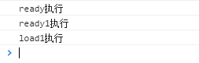

很久以前，大家会用Jquery，其中有个函数$(function(){...})，它的意思是在document.ready的时候执行里面的匿名函数。

那么ready和load又有什么区别呢？要知道这个区别，得先了解DOM文档的加载和执行顺序。

## DOM文档加载步骤

1.解析html结构

2.加载外部的脚本和样式文件

3.解析并执行脚本代码

4.执行document.ready阶段的代码

5.加载图片等二进制资源

6.页面加载完毕，执行window.onload资源

## Ready

Dom ready的意义是在DOM节点创建完成后执行，一般页面的加载顺序是：域名解析-加载html页面-加载JS和css-加载图片等资源，DOM ready是介于加载JS、CSS和图片资源之间的。

## Load

Dom load是在页面所有资源都加载完成之后执行的，也就是说在图片资源加载完成之后。

## Demo

```
<script type="text/javascript">
    $(function () {
        console.log("ready执行");
    });

    $(function() {
        console.log("ready1执行");
    });

    window.onload = function () {
        console.log('load执行');
    };

    window.onload = function () {
        console.log('load1执行');
    }
</script>
```

执行结果是：




由此可见：

window.onload如果有多个定义，只会执行最后一个。

参考资料：

<https://blog.csdn.net/fuzhongmin05/article/details/73521769>