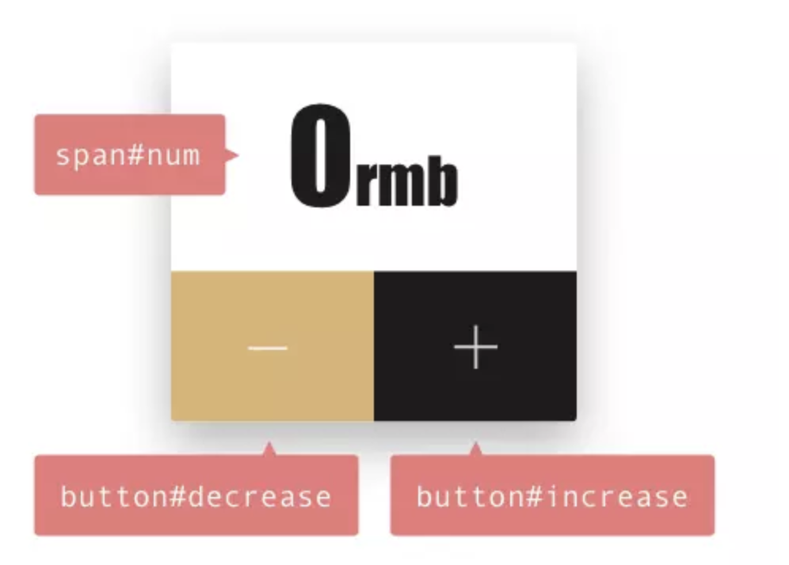
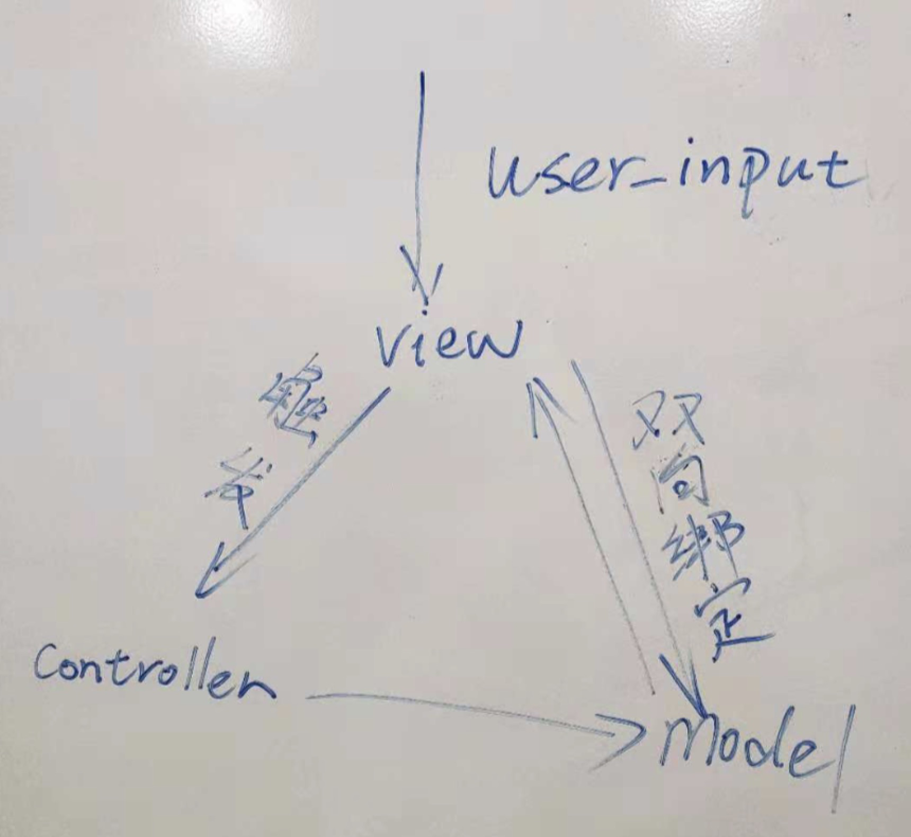
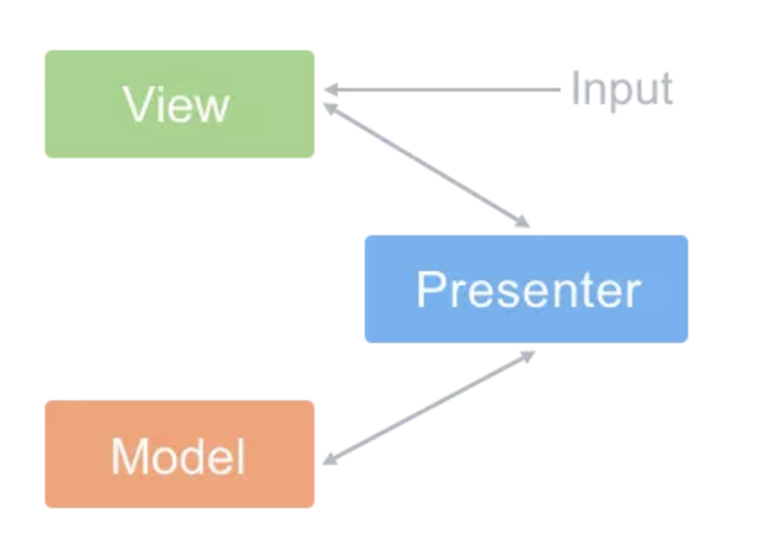
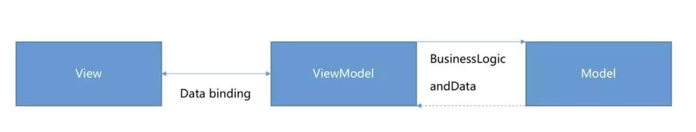

## 为什么会引入这些设计模式？

在没有这些设计模式的野蛮时代，我们是如何写代码的？比如要实现一个这样的需求: 开发一个页面，上面显示一个数值和两个按钮，可以用这两个按钮进行加减操作，操作后的数值会更新显示。



我们的代码是这样的：

```
<html>
  <head>
    <style>
      #num{
        width: 50px;
        height: 30px;
        border: 1px solid red;
        text-align: center;
        vertical-align: middle;
      }
    </style>
  </head>
<body>
  <span id="num">0</span>
  <button id="increase">increase</button>
  <button id="decrease">decrease</button>
  
  <script>
    var count = 0
    var num = document.getElementById('num')
    var increaseBtn = document.getElementById('increase')
    var decreaseBtn = document.getElementById('decrease')

    increaseBtn.addEventListener('click', function () {
      count++
      num.innerText = count
    })

    decreaseBtn.addEventListener('click', function () {
      count--
      num.innerText = count
    })
  </script>
</body>
</html>
```

如果需求改为：再创建一个新页面，要求有类似的逻辑，有两个加减按钮，可以改变视图中某个变量的值，但是要求老页面中的count大于10的话，就不继续增加数值了，新页面中的count小于等于0的话，就不继续减少数值了。

实现这个需求，最笨的方法就是再新建一个HTML文件，把老文件的代码都拷贝过来，按需求改动一下来实现效果。但是这样做的话，项目中的重复代码就很多，而且视图和逻辑没有分离，项目出现问题后也不易排查。如果让我来做这个需求，肯定是把能公用的逻辑抽离出来，让视图和业务逻辑分离开，这样出现问题，也比较好定位。前辈们肯定也是基于此才先后在前端引入了各种设计模式，使我们尽可能的以模块化的思维开发项目。

## 一、MVC

MVC分为传统MVC和Web MVC，Web MVC又分为前端MVC和后端MVC，本文只针对Web 前端MVC来做说明。

先把原理图放出来：



先简单说下原理，接下来看各个部分的代码实现，建议看完代码实现后，再回头来看下这段原理介绍。

一个View对应一个Controller，一个Model可以对应多个View。用户在View视图层的输入会触发controller的调用，比如用户在视图上点击“+”按钮，controller得到事件触发后，来决定调用Model的逻辑改变数据，Model和View层通过发布-订阅的模式相连接，Model层数据变化后，会通知所有订阅的视图重新执行渲染操作。整个过程就是：用户触发了点击事件，事件改变了数据，数据变化会通知页面，页面拿到新数据，重新渲染。

Controller

```
根据上面的需求，会有两个视图，因此我们就创建两个controller

// 对应视图1的controller
function Controller1(model) {
  this.model = model
}

Controller1.prototype.onAddCount = function(count) {
  if (count > 10) return
  this.model.increase(count)
}

Controller1.prototype.onDecCount = function(count) {
  this.model.decrease(count)
}

module.exports = Controller1

// 对应视图2的controller
function Controller2(model) {
  this.model = model
}

Controller2.prototype.onAddCount = function(count) {
  this.model.increase(count)
}

Controller2.prototype.onDecCount = function(count) {
  if (count <= 0) return 
  this.model.decrease(count)
}
module.exports = Controller2
```

View

```
//视图1
function View1(controller, model) {
  this.controller = controller
  this.model = model
  this.model.register(this) //收集视图1
  this.template = compile($("#view1").html(this.model.getVal()))
  this.$el = $("<div class='view1'></div>")
}

View1.prototype.build = function() {
  this.render()
  this.listen()
}

View1.prototype.render = function() {
  this.$el.html(this.template())
}

View1.prototype.listen = function() {
  var self = this
  this.$el
    .find("view1.increase-btn")
    .on("click", function() {
      var num = $('view1.count').val()
      self.controller.onAddCount(num)
    })
    
  this.$el
    .find("view1.decrease-btn")
    .on("click", function() {
      var num = $('view1.count').val()
      self.controller.onDecCount(num)
    })
}

module.exports = View1


//视图2
function View2(controller, model) {
  this.controller = controller
  this.model = model
  this.model.register(this) //收集视图2
  this.template = compile($("#view2").html(this.model.getVal()))
  this.$el = $("<div class='view2'></div>")
}

View2.prototype.build = function() {
  this.render()
  this.listen()
}

View2.prototype.render = function() {
  this.$el.html(this.template())
}

View2.prototype.listen = function() {
  var self = this
  this.$el
    .find("view2.increase-btn")
    .on("click", function() {
      var num = $('view2.count').val()
      self.controller.onAddCount(num)
    })

  this.$el
    .find("view2.decrease-btn")
    .on("click", function() {
      var num = $('view2.count').val()
      self.controller.onDecCount(num)
    })
}

module.exports = View2
```

Model

```
function Model() {
  this.count = 5
  var self = this, views = []
  // 发布订阅模式
  this.register = function(view) {
    views.push(view);
  }

  this.notify = function() {
    for(var i = 0; i < views.length; i++) {
        views[i].render(self);
    }
  }

  this.increase = function () {
    this.count = this.count + 1
    this.notify()
  }
  this.decrease = function () {
    this.count = this.count - 1
    this.notify()
  }
  this.getVal = function () {
    return this.count
  }
}

module.exports = Model
```

初始化这个应用

```
function initApp() {
  var model = new Model
  var controller1 = new Controller(model)
  var view1 = new View1(controller1, model)
  view1.build()

  var controller2 = new Controller(model)
  var view2 = new View2(controller1, model)
  view2.build()
}

initApp()
```

到此，一个采用MVC架构的web应用就完成了，可以看到业务逻辑层和视图层拆分开了，但是一个视图层绑定了一个控制层，如果我想要复用view的话，该怎么办呢？要解决这个问题，就引入了MVP设计模式。

## 二、MVP

mvp是mvc的改良版，它把view和model隔离开了，先上原理图：



用户点击页面上的按钮，触发绑定在view上的点击事件，调用presenter的业务逻辑，presenter收到调用通知后，去调用model层处理数据，然后再调用view层更新视图，我们把上面的例子简化，专注于各层之间的调用关系。

View

```
function View() {
  this.presenter = null
  this.template = compile($("#view1").html())
  this.$el = $("<div class='view'></div>")
}

View.prototype.build = function() {
  this.render()
  this.listen()
}

View.prototype.render = function() {
  this.$el.html(this.template())
}

View.prototype.setPresenter = function(presenter) {
  this.presenter = presenter
}

View.prototype.listen = function() {
  var self = this
  this.$el
    .find("view.increase-btn")
    .on("click", function() {
      var num = $('view.count').val()
      //看到这里你可能会有疑问，在初始化View构造函数的时候，并没有传入presenter对象，又如何调用presenter的onAddCount方法呢？可以耐心看到下面，其实在初始化Presenter的时候，调用了view对象的setPresenter方法，从而把presenter对象的属性和方法绑定到view对象的私有属性presenter上。因此可以看出在MVP模式中，view模块是相对独立的，好处是view模块可以复用，对view的操作和对model的调用全部放在了presenter层，当业务庞大的时候，这一层会很fat，这也是为什么后面又引入了MVVM模式。
      self.presenter.onAddCount() 
    })
}

View.prototype.getVal = function() {
  return this.$el.find("num").val()
}

View.prototype.setVal = function(content) {
  return this.$el.find("num").val(content)
}

module.exports = View
```

Presenter

```
function Presenter(view, model) {
  this.view = view
  this.model = model
  this.init()
}

Presenter.prototype.init = function() {
  this.view.setPresenter(this)
  this.view.build()
}

Presenter.prototype.onAddCount = function() {
  var count = this.view.getVal()
  if (count > 10) return
  //presenter调用model处理逻辑，然后把新数据传递给view，重新渲染视图
  this.model.increase(count)
  this.view.setVal(this.model.getValue())
}

module.exports = Presenter
```

Model

```
function Model() {
  this.count = 5

  this.increase = function (num) {
    this.count = this.count + num
  }

  this.getValue = function () {
    return this.count
  }
}

module.exports = Model
```

初始化应用

```
function initApp() {
  var view = new View
  var model = new Model
  var presenter = new Presenter(view, model)
}

initApp()
```

从初始化的代码也可看出，model和view互相没有直接联系，这使得他们可以作为独立模块来复用。其中Presenter起到一个中枢神经的作用，业务逻辑主要放在了这一层，因此这一层也会比较臃肿。

## 三、MVVM

MVVM是目前前端领域最流行的模式，最著名的Vue就是MVVM架构的。



Model层可以被称为数据层，因为model不关心业务逻辑，只关注数据本身，也可以把model理解成一个类似于json的数据对象

Model

```
var data = {
    num: 5
}
```

View层是通过模板语法，声明式的把数据渲染到视图中

```
<div id="myapp">
    <div>
        <span>{{ num }}</span>
    </div>
    <div>
        <button v-on:click="increase(1)">+</button>
        <button v-on:click="decrease(1)">-</button>
    </div>
</div>
```

ViewModel类比于MVP中的Presenter，与之不同的是，在ViewModel中不需要开发者在开发的时候显示的调用view对象的渲染接口。采用MVVM架构的框架会在初始化ViewModel的时候，应用数据劫持+发布-订阅模式实现数据和视图的响应式变化（这部分详见Vue的框架原理）。也就是model中的数据改变了，会触发view的更新渲染。view层的数据变化，也会引起model中数据的变化。

```
new ViewModel({
    el: '#myapp',
    data: data,
    methods: {
        increase(v) {
            if(this.val < 10) {
                this.val += v;
            }
        },
        decrease(v) {
            if(this.val > 0) {
                this.val -= v;
            }
        }
    }
});
```

可以看到实现了MVVM架构的框架帮我们封装了需要手动调用的逻辑，使各个模块的开发更独立，简化了开发流程，工程师可以用更短的时间开发出更好维护的项目，人类真是为了可以心安理得的懒惰，而无所不用其极，也应了那句名言：

```
懒惰才是第一生产力        ___伊丽莎白.老仙女
```

## 总结

三种很抽象的设计模式，用代码实现一遍就很好理解了，工程师的世界，知行合一才是进步的最短路径。

若有不同的理解，欢迎提issue。

参考资料：

https://juejin.im/post/593021272f301e0058273468

https://github.com/livoras/MVW-demos


