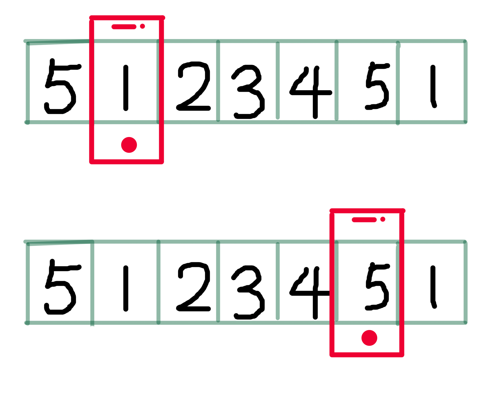

## 原理 

此处实现的轮播图是无限自动循环播放轮播图

假设有四个坑位，循环轮播，原理就是在最后一位插入一个占位坑，这个占位坑的内容和1坑一模一样，当即将要切换到这个占位坑时，迅速把坐标移动为真实的1坑，这样肉眼上看起来是循环播放的。

网络盗个图，侵删




## 代码

```
<html>
  <head>
    <style>
      div{
        width: 500px;
        border: 1px solid turquoise;
        overflow: hidden;
        position: relative;
        height: 200px;
      }
      ul{
        width: 3000px;
        padding: 0;
        margin: 0;
        border:1px solid red;
        position: absolute;
      }
      li{
        float: left;
        width: 500px;
        font-size: 30px;
        color: #000;
        background-color: brown;
        text-align: center;
        height: 200px;
        line-height: 200px;
        list-style: none;
      }
    </style>
  </head>
  <body>
    <div>
      <ul style="left:0">
        <li>1</li>
        <li>2</li>
        <li>3</li>
        <li>4</li>
        <li>1</li>
      </ul>
    </div>
  </body>
  <script>
    var ul = document.getElementsByTagName('ul')[0]
    var li = document.getElementsByTagName('li')
    var count = 1
    var timer
    function next () {
      var offset = -500 //视觉上向右移动一个li，ul的坐标就需要往左拉动一个li元素的宽度
      var newLeft = parseInt(ul.style.left) + offset
      var interval = 10 //每隔10ms图片移动一次
      var time = 400 //设置300ms移动完一张图
      var speed = offset / time //图片移动的速度
      var s = speed * interval //10ms能移动的距离
      // 无缝轮播的核心在于将要移动最后一个占位1的时候，迅速把位置切换到真实1的坐标
      function go() {
        // 判断每个li模块是否移动完毕
        if (parseInt(ul.style.left) > newLeft) {//还在移动中
          ul.style.left = parseInt(ul.style.left) + s + 'px'
          setTimeout(go, interval);
        } else {
          if (newLeft < -2000) {//-2000是移动完前四个的距离，也就是即将要移动占位1的时候，把坐标切换成真实1，障眼法。
            ul.style.left = 0
          }
        }
      }
      go()
    }
    function lunbo() {
      timer = setInterval(next, 3000); //每隔2秒切换下一张图
    }
    lunbo()
  </script>
</html>
```

## 实践

经实践发现，直接用li元素切换到1的时候，稍微有点闪动，如果替换成图片，闪动就基本不可见了

```
<ul style="left:0">
          <li></li>
          <li></li>
          <li></li>
          <li></li>
          <li></li>
      </ul>
```

朋友们，可以手动撸一个试试。

参考资料：https://github.com/Youszz/baidu_2017_frontEnd_study/tree/master/tooltrips


